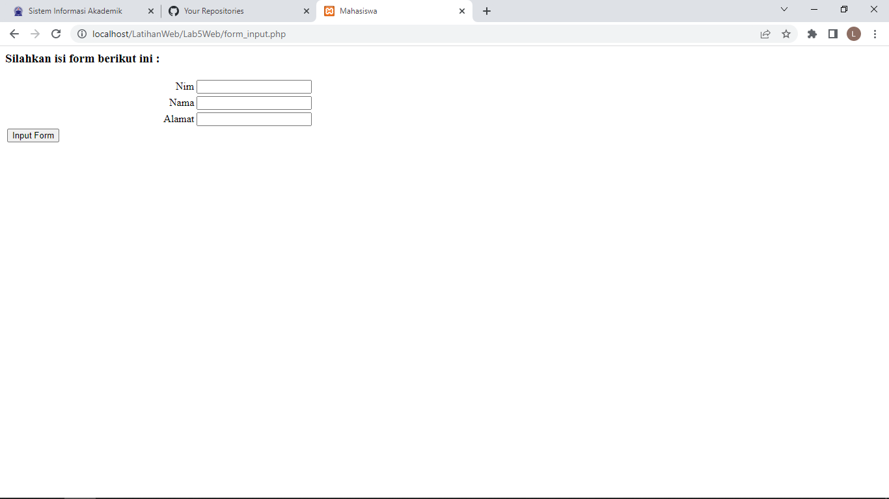
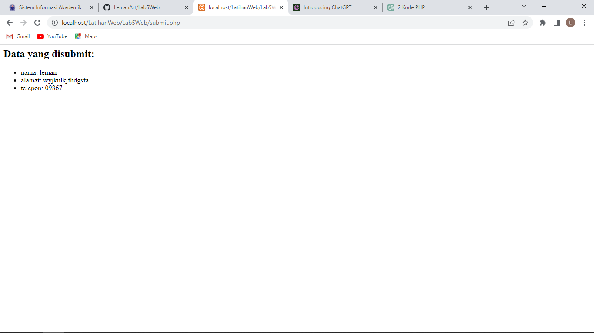

# Lab5Web
1. membuat form.php
    ```php
    <?php

    /**
    * Nama Class: Form
    * Deskripsi: CLass untuk membuat form inputan text sederhan
    **/
    class Form
    {
        private $fields = array();
        private $action;
        private $submit = "Submit Form";
        private $jumField = 0;
        public function __construct($action, $submit)
        {
            $this->action = $action;
            $this->submit = $submit;
        }
        public function displayForm()
        {
            echo "<form action='" . $this->action . "' method='POST'>";
            echo '<table width="100%" border="0">';
            for ($j = 0; $j < count($this->fields); $j++) {
                echo "<tr><td

    align='right'>" . $this->fields[$j]['label'] . "</td>";

                echo "<td><input type='text'

    name='" . $this->fields[$j]['name'] . "'></td></tr>";
            }
            echo "<tr><td colspan='2'>";
            echo "<input type='submit' value='" . $this->submit . "'></td></tr>";
            echo "</table>";
        }
        public function addField($name, $label)
        {
            $this->fields[$this->jumField]['name'] = $name;
            $this->fields[$this->jumField]['label'] = $label;
            $this->jumField++;
        }
    }
    ?>
    ```
<br> File tersebut tidak dapat dieksekusi langsung, karena hanya berisi deklarasi class. Untuk
menggunakannya perlu dilakukan include pada file lain yang akan menjalankan dan harus dibuat
instance object terlebih dulu.<br>

2. membuat form_input.php
    ```php
    <?php
    /**
    * Program memanfaatkan Program 10.2 untuk membuat form inputan sederhana.
    **/
    // include file class Form
    include 'form.php';

    // membuat objek dari class Form
    $form = new Form('submit.php', 'Submit Form');

    // menambahkan field pada form
    $form->addField('nama', 'Nama');
    $form->addField('alamat', 'Alamat');
    $form->addField('telepon', 'Telepon');

    // menampilkan form
    $form->displayForm();

    ?>
    ```
    <br> maka hasilnya seperti ini
    

3. membuat .php untuk menampilkan data yang disubmit
    ```php
    <?php
    // mengecek apakah ada data yang disubmit
    if ($_SERVER['REQUEST_METHOD'] == 'POST') {
        // menampilkan data yang disubmit
        echo "<h2>Data yang disubmit:</h2>";
        echo "<ul>";
        foreach ($_POST as $key => $value) {
            echo "<li>" . $key . ": " . $value . "</li>";
        }
        echo "</ul>";
    }
    ?>
    ```
    <br> maka hasilnya seperti ini
    njelasn